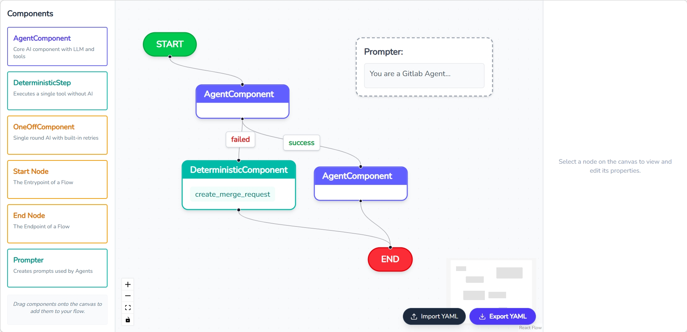

<h1 style="text-align: center" width="100%"> A visual editor for GitLab Duo workflows </h1>
<br />



## Features

- 💯 Open Source
- All Gitlab flow tools (As of March 2026)
- Supports linear and conditional flow logic
- Yaml Importing and Exporting
- Zooming and Panning
- Just a cool project 🕶


### Prerequisites
- Nodejs (v16.8 or later)
- npm package manager
- A code editor or terminal.

## 2-step start

1. Clone and cd into the repo

2. Enter the command  below
    ```bash
    > flow # installs dependencies -> builds project -> starts server.
    ```

Open [http://localhost:3000](http://localhost:3000) with your browser and your done!!

